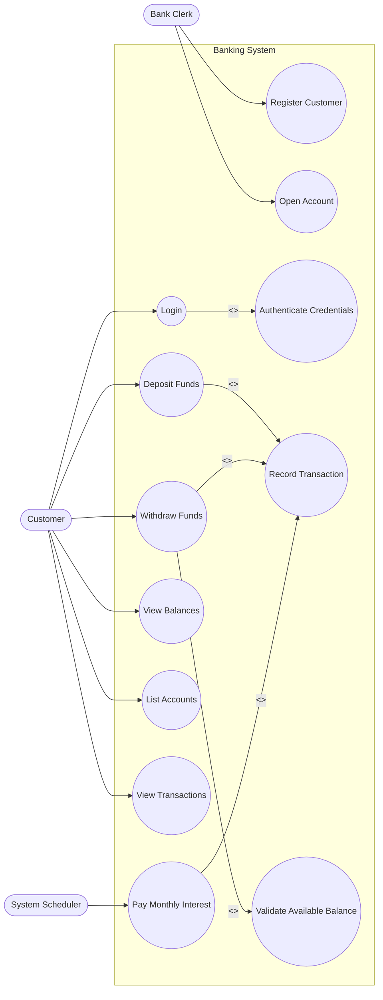
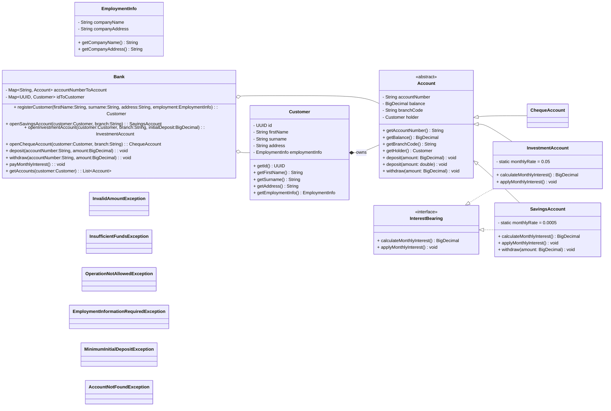
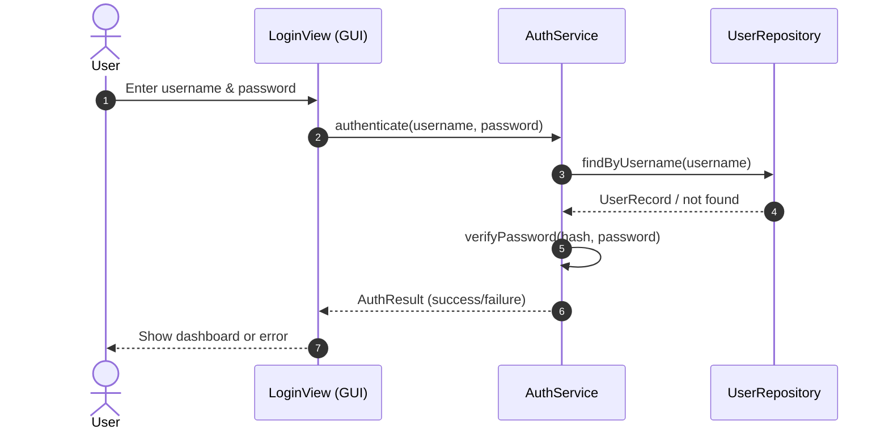
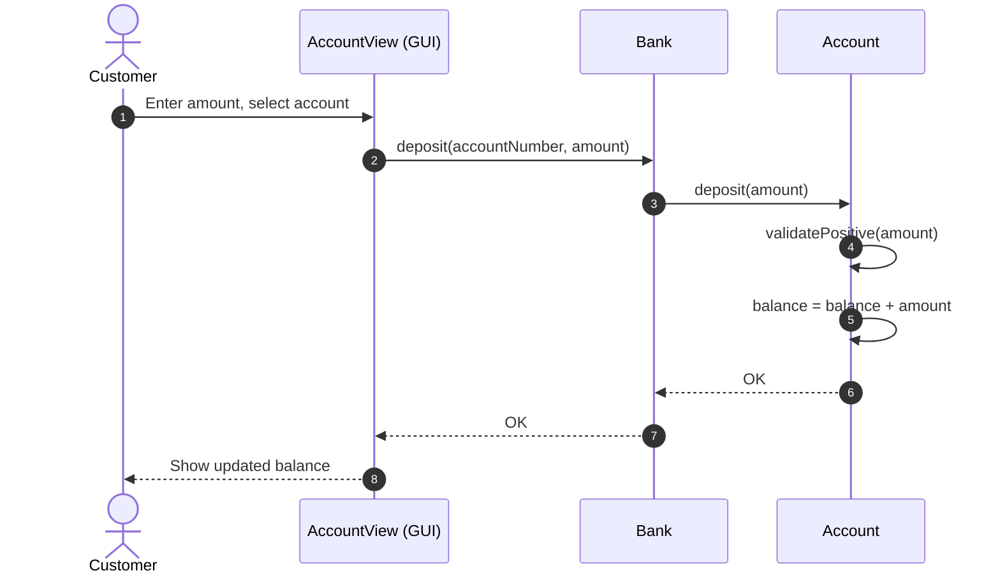
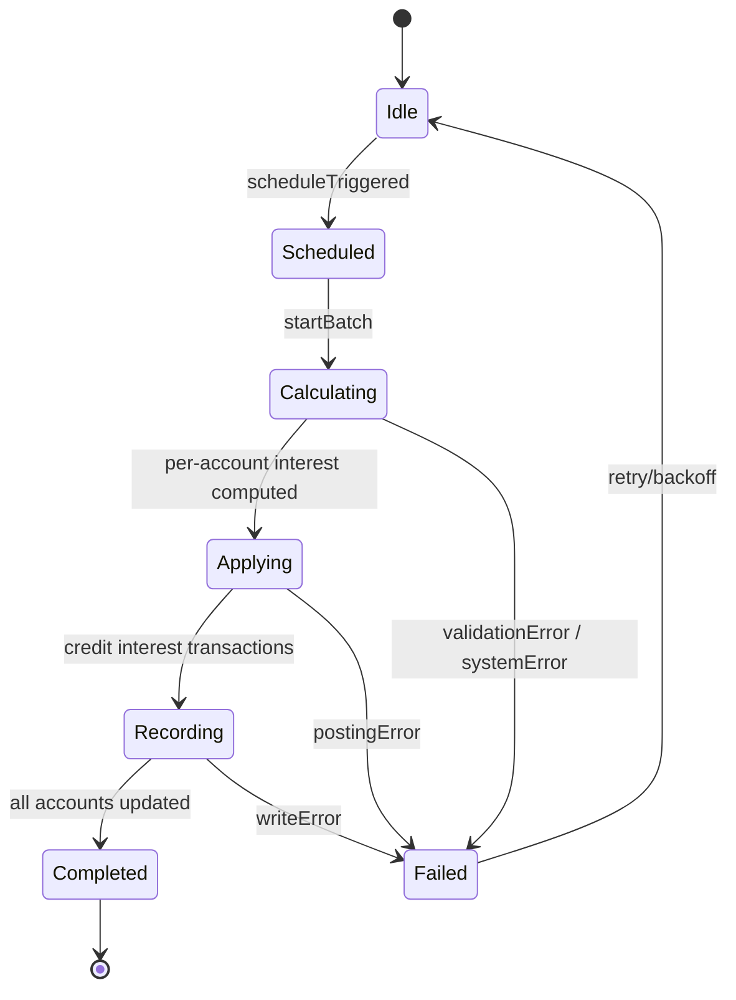

## UML Diagrams (Mermaid)

### Use Case Diagram
Note: Mermaid does not have a native UML Use Case syntax; we approximate with a flowchart and labeled relationships.

### Class Diagram

### Sequence Diagram: Login

### Sequence Diagram: Deposit Funds

### State Diagram: Pay Monthly Interest

